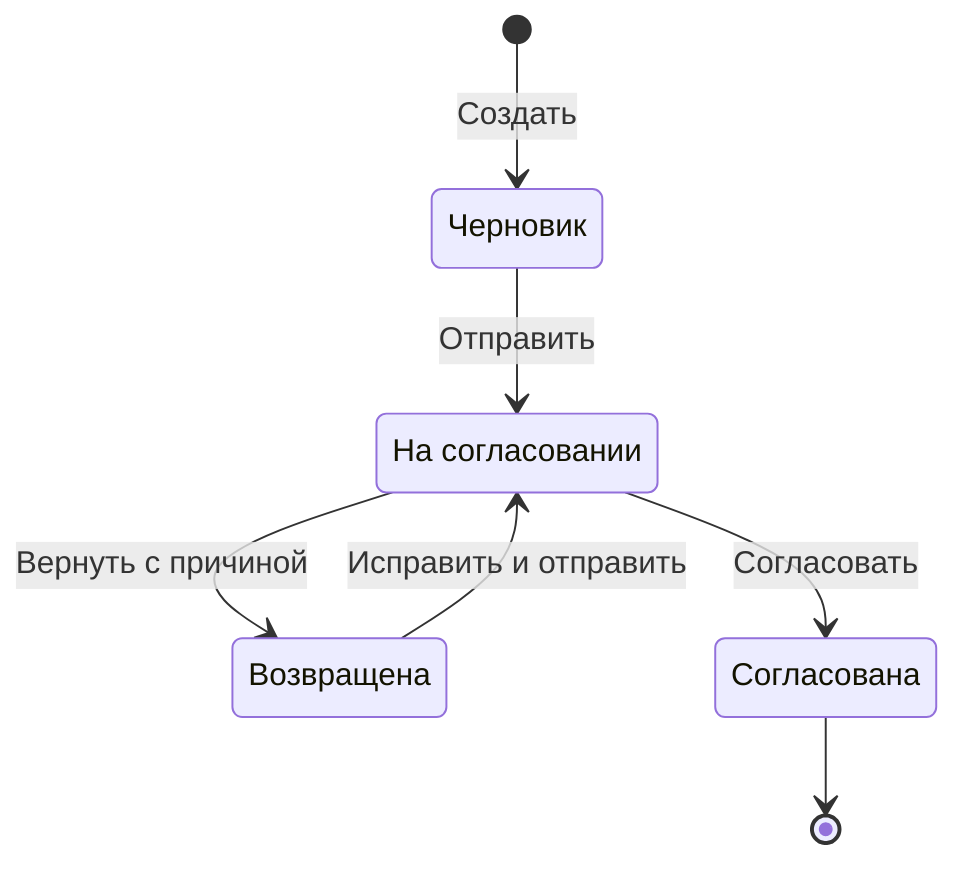
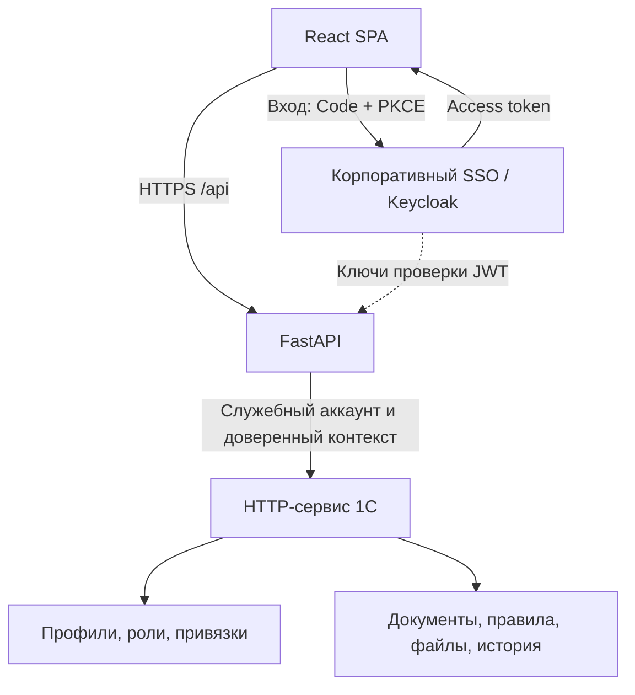

# 1C + React Lessons — от AI-прототипа до рабочего портала

## 1. Цель курса

Научить разработчика 1С создавать и сопровождать production веб-приложение с помощью AI coding agent, сохраняя бизнес-данные и бизнес-правила в 1С.

**Результат обучения:** разработчик умеет поставить агенту ограниченную задачу, понять изменения, проверить их локально в Windows, провести через ветку и Pull Request, обновить production на Linux и подтвердить результат.

Курс ведётся на русском. Основная архитектура: **React + TypeScript → FastAPI → HTTP-сервис 1С**. Разработка — Windows, production React и FastAPI — Linux. Docker и Docker Compose пока не используются. GitHub Pages не является темой курса и способом развёртывания учебного приложения.

Текущий сайт материалов: [1C + React Lessons](https://nurbolatkz.github.io/github_1c_web_lesons/).

Документ описывает обновлённую программу и предлагаемые уточнения архитектуры. Это план обучения, а не подтверждение реализации или проверки реального KKT Portal Demo. Portal Studio в объём курса не входит.

## 2. Как преподавать разработчикам 1С

Ученик уже понимает документы, справочники, регистры, формы и бизнес-процессы. Новые понятия вводятся через знакомые задачи.

| Знакомо в 1С | Что изучаем в вебе | Важное отличие |
| --- | --- | --- |
| Форма списка | React list page | Данные приходят отдельным HTTP-запросом; нужны загрузка, ошибки и пагинация |
| Форма объекта | Detail page и Create/Edit form | Просмотр и ввод разделены по ответственности |
| Форма выбора | ReferencePicker и отдельный selector | Поиск и права проверяются на сервере; нельзя загрузить весь справочник в браузер |
| Ссылка на объект | Стабильный ID в API | Отображаемое имя не является идентификатором; знание ID не даёт право доступа |
| Проверка заполнения | Валидация формы, схемы API и правила 1С | В браузере — удобство, в FastAPI — форма запроса, в 1С — бизнес-допустимость |
| Права и ограничения доступа | Permission + scope + состояние документа | Проверяется действие над конкретным объектом, а не только роль пользователя |
| Запись и транзакция | API-команда и результат в 1С | Тайм-аут ответа не доказывает, что запись не произошла |
| Журнал регистрации | Логи, request_id и бизнес-история | Ошибку нужно проследить через браузер, FastAPI и 1С |
| Обновление конфигурации | Версионированный выпуск web + API + 1С | Компоненты могут обновляться отдельно; нужна совместимость и порядок выпуска |

**Принцип занятия:** один рабочий сценарий, одна задача в GitHub, одна ветка, один проверяемый результат. AI помогает писать код; ученик объясняет его поведение и предъявляет доказательства проверки.

Не нужно сначала проходить весь JavaScript и весь Python. Нужный минимум изучается рядом с задачей: JSON при первом API, async при запросе, TypeScript при описании документа, транзакция при сохранении.

## 3. Учебный проект: портал заявок на транспортировку

Вместо абстрактного каталога товаров используем уменьшенный реальный бизнес-сценарий из архитектуры KKT: **заявка на транспортировку → отправка → согласование или возврат**.

Все организации, пользователи, номера и маршруты в учебном наборе вымышлены. Предлагаемые статусы и ограничения служат учебным примером; для рабочего KKT их нужно сопоставить с действующими правилами конфигурации 1С.

### Участники и данные

| Участник | Область данных | Разрешённые действия в учебном сценарии |
| --- | --- | --- |
| Менеджер организации «Север Демо» | Своя организация | Создать и изменить черновик; отправить; исправить возвращённую заявку |
| Менеджер организации «Юг Демо» | Только своя организация | Те же действия; без доступа к документам «Север Демо» |
| Диспетчер | Назначенные ему организации | Прочитать отправленную заявку, согласовать или вернуть с причиной |
| Администратор доступа | Профили и назначения в 1С | Управлять доступом; это само по себе не даёт права согласовывать документы |

Заявка содержит номер, дату, организацию/потребителя, договор, маршрут, период, объём в тоннах, ответственного, статус и версию. Дополнительно — файлы и история.

Пример: заявка №000000799, «Север Демо», октябрь 2026, маршрут «Пункт А → Пункт Б», объём 1 200 т. Точность объёма в учебном контракте — три десятичных знака; это договорённость примера, а не универсальное правило 1С.

### Жизненный цикл



Переходы выполняются командами в 1С. Клиент не может произвольно записать `status=approved`. Перед каждым переходом 1С проверяет текущий статус, бизнес-условия и права действующего пользователя в доверенном контексте.

### Что ученик показывает преподавателю

1. Менеджер выбирает договор и маршрут, вводит объём и сохраняет черновик. Тот же документ виден в учебной 1С.
2. Менеджер отправляет заявку. Диспетчер другой учётной записью видит её в своей области и возвращает с причиной.
3. Менеджер исправляет заявку; диспетчер согласовывает. Поля согласованного документа нельзя изменить ни через UI, ни прямым API-запросом.
4. Менеджер «Юг Демо» не получает заявку «Север Демо» при подстановке её ID, включая файлы и историю.
5. Повторное сохранение с тем же ключом операции не создаёт второй документ.
6. Два пользователя редактируют одну версию: второе сохранение получает конфликт, а первая запись не теряется.
7. После выпуска на Linux тот же сценарий работает в согласованном тестовом контуре.

## 4. Архитектура: что сохраняем и что уточняем

Сохраняем утверждённые границы KKT: React отвечает за интерфейс; FastAPI — за контролируемый API; 1С — за бизнес-данные, назначения доступа и бизнес-правила. Не вводим универсальный движок документов и не переносим бизнес-логику в Python.



### Распределение ответственности

| Область | Владелец | Уточнение для production |
| --- | --- | --- |
| Подтверждение личности | SSO | React получает access token; FastAPI проверяет его перед использованием |
| Профиль, назначения и области | 1С | Пользователь сопоставляется с внешней идентичностью; клиент не присылает доверенные права |
| Проверка доступа на API | FastAPI | Действие + объект + область данных; отсутствие разрешения означает отказ |
| Бизнес-правила и переходы статуса | 1С | Проверяются в момент выполнения команды, включая вызовы из других каналов |
| Формат запроса | FastAPI | Типы, обязательность, длины, лимиты; неизвестные записываемые поля отклоняются |
| UX-валидация | React | Ранние подсказки; серверная ошибка остаётся окончательным результатом |
| Фильтрация и пагинация | 1С с контекстом от FastAPI | Ограничение области до выборки и подсчёта; FastAPI нормализует допустимые параметры |
| Бизнес-история | 1С | Кто выполнил команду, что изменилось, когда и с каким результатом |
| Техническая диагностика | FastAPI и инфраструктура | request_id, длительность и тип ошибки; без паролей, токенов и полного тела чувствительных запросов |

Проверки на каждом запросе и проверка конкретного объекта соответствуют рекомендациям [OWASP по авторизации](https://cheatsheetseries.owasp.org/cheatsheets/Authorization_Cheat_Sheet.html). Скрытая кнопка в React не заменяет эти проверки.

### Уточнения к SSO и границе доверия

- Сохраняем **OIDC Authorization Code + PKCE** и SPA-модель. Браузер не хранит client secret. Используется готовый адаптер, а не самостоятельно написанный OAuth.
- Для FastAPI передаётся **access token**, не ID token. Проверяются подпись, разрешённый алгоритм, issuer, audience и срок действия; неизвестный ключ не принимается. Обработку JWKS выполняет подходящая библиотека с контролируемыми настройками. Основа проверки — [OWASP REST Security](https://cheatsheetseries.owasp.org/cheatsheets/REST_Security_Cheat_Sheet.html).
- `sub` уникален в пределах issuer. При одном фиксированном issuer допустим прежний поиск по `externalId=sub`; для нескольких провайдеров ключ связи — `(iss, sub)`. Email и имя не используются как стабильный ключ. Это следует из определения subject в [OpenID Connect](https://openid.net/specs/openid-connect-core-1_0.html).
- В SPA access/refresh token остаются в памяти адаптера. Обновление сессии, отказ refresh и logout отрабатываются явно; токены не сохраняются в localStorage. Такой подход описан в [Keycloak JavaScript adapter](https://www.keycloak.org/securing-apps/javascript-adapter).
- Профиль из 1С можно кэшировать кратко. «5 минут» — обсуждаемый TTL, а не гарантия мгновенного отзыва прав. Для критических команд 1С проверяет актуальные назначения; устаревший кэш FastAPI не должен разрешать запись после отзыва. Ошибка получения профиля не превращается в разрешение.
- Браузерные `X-Portal-User-Id`, `X-Signature` и похожие заголовки не принимаются как доверенные. FastAPI формирует контекст после проверки токена; 1С принимает его только от аутентифицированного gateway.
- FastAPI → 1С: HTTPS, ограниченный служебный аккаунт и ограниченная сетевая доступность. HMAC остаётся дополнительным вариантом при необходимости, не заменяет TLS и права. Если он нужен, подписывают также метод, путь, хеш тела и контекст пользователя; timestamp/nonce проверяются с защитой от повтора. Самодельную криптографию ученики не проектируют.

### Что оптимизируем

| Предложение | Зачем |
| --- | --- |
| Один origin: React и `/api` через nginx | Упрощает production-маршрутизацию. Локально — dev proxy или явный разрешённый origin; CORS не используется как механизм авторизации |
| Один FastAPI-сервис с отдельными модулями | Удобен для небольшой команды; микросервисы пока не нужны |
| Изолированный адаптер 1С | HTTP-клиент, тайм-ауты и преобразования сосредоточены в одном месте |
| Контракт и DTO до генерации экранов | Агент не выдумывает поля, статусы и API; интерфейс не зависит от случайных имён метаданных 1С |
| Фильтрация на стороне источника | Не загружаем все документы в Python для последующей фильтрации и разбиения на страницы |
| Версия документа и ключ операции | Защита от потери параллельных изменений и дублей при повторной отправке |
| Небольшие общие компоненты | Переиспользуем поля, статусы и выбор, сохраняя отдельные бизнес-экраны |
| Минимум инфраструктуры | Без второй копии бизнес-БД, Redis, очередей и Docker в базовом курсе; добавление — только под измеренную задачу |

Async применяется к сетевому ожиданию осознанно: блокирующий вызов 1С нельзя просто поместить в `async def` и считать неблокирующим. В уроке разбирается выбор совместимого HTTP-клиента и выполнение блокирующей работы на основе [документации FastAPI](https://fastapi.tiangolo.com/async/).

## 5. План: 24 коротких урока в 6 блоках

Это расширение прежнего плана из 13 уроков: темы разделены, чтобы production-навыки не оказались одной перегруженной финальной главой. Обычное занятие — одна небольшая задача; объёмные лабораторные по SSO и Linux можно разбить на несколько практических сессий. Фиксированные сроки обещать до пробного прохождения не следует.

### Блок I. Инструменты и командная работа

| № | Тема | Навык | Практика и проверяемый результат |
| --- | --- | --- | --- |
| 00 | От документа 1С к веб-порталу | Выделить роли, данные, статусы и критерии приёмки | Нарисовать процесс одной заявки; объяснить, кто может выполнить каждый переход |
| 01 | Аккаунты, Windows и CLI | GitHub, выбранный Codex/Claude, Git, Node.js, Python, редактор, PowerShell | Установить инструменты, авторизоваться, проверить версии, запустить готовый пример и остановить процессы |
| 02 | Репозиторий и ветка задачи | clone, status, diff, add, commit, push; Issue и именование веток | Создать задачу и ветку `feat/12-request-list`, отправить первый небольшой коммит |
| 03 | Команда: pull, PR, review, merge | Обновить код, проверить чужой PR и разрешить конфликт | Два участника меняют одну строку в разных ветках; сохраняют смысл обоих изменений после merge |

**Контрольная точка:** второй человек клонирует репозиторий и воспроизводит запуск. Новая задача всегда начинается с новой ветки актуальной `main`.

### Блок II. Веб-основа, архитектура и первая интеграция

| № | Тема | Навык | Практика и проверяемый результат |
| --- | --- | --- | --- |
| 04 | Веб для разработчика 1С | HTTP, JSON, URL, методы, коды ответа, браузерные Network/Console, async | Найти реальный запрос страницы, прочитать ответ и отличить ошибку UI от ошибки API |
| 05 | Структура проекта и работа с AI | Контекст, ограничения, план, diff, AGENTS.md / CLAUDE.md | Попросить агента изменить только один модуль; объяснить каждый изменённый файл |
| 06 | Бизнес-модель и API-контракт | Поля, ID, DTO, дата/время, точные числа, null, ошибки, пагинация | Описать заявку и справочники, согласовать JSON и сценарии до генерации формы |
| 07 | Первый сквозной запрос | Пройти React → FastAPI → 1С на готовом каркасе | Получить одну заявку из учебной 1С и найти один request_id в связанных логах |

**Контрольная точка:** реальные данные прочитаны из учебной 1С. До уроков SSO и прав этот каркас доступен только локально/в закрытом учебном контуре, с учебными данными, без публичного production-доступа. Подготовленные заглушки не выдаются за готовую авторизацию.

### Блок III. Предметный интерфейс с AI

| № | Тема | Навык | Практика и проверяемый результат |
| --- | --- | --- | --- |
| 08 | Реестр заявок | React/TypeScript, состояние запроса, фильтры, поиск, таблица, серверная пагинация | Построить list page; проверить загрузку, пустой результат, ошибку и переход между страницами |
| 09 | Карточка документа | Роутинг, чтение по ID, поля, метаданные, вкладки | Построить detail page с постоянной шириной; обновление URL открывает тот же документ |
| 10 | Формы выбора | Отдельный selection UI, поиск и выбор ID | Выбрать договор и маршрут; отмена не меняет поле, недоступный договор не появляется в списке |
| 11 | Создание и редактирование | Общая бизнес-форма, отдельные create/edit pages, ошибки полей, несохранённые изменения | Собрать форму на контрактных mock-ответах; пустое значение, ноль и неверный период обрабатываются различимо |

**Контрольная точка:** есть отдельные list, detail, form, selection. Ни один UI-компонент не становится универсальной страницей всех документов. Запись в 1С подключается после серверных прав.

### Блок IV. API, 1С и доступ

| № | Тема | Навык | Практика и проверяемый результат |
| --- | --- | --- | --- |
| 12 | FastAPI gateway | Router, схемы, dependencies, адаптер, тайм-ауты, нормализация ошибок | Подменить ответ 1С на ошибку; браузер получает понятный код и request_id, а не traceback |
| 13 | HTTP-сервис 1С | Чтение, запись, запросы с областью доступа, валидация, транзакции | Реализовать обработчики в учебной базе; недопустимая команда не оставляет частично записанных данных |
| 14 | SSO и профиль портала | Code + PKCE, access token, JWT validation, связь `(iss, sub)` с 1С | Войти двумя пользователями; неверная audience и истёкшая сессия не дают доступ к API |
| 15 | Permissions, scopes и доступ к объекту | Право действия, организация/потребитель/PSP, запрет по умолчанию | Подставить чужой ID в запрос чтения и записи; получить отказ без утечки документа или его существования по принятой политике |

**Контрольная точка:** технический аккаунт 1С не превращает всех пользователей портала в администратора. Проверяются также selection, файлы, история, счётчики и массовые операции, если они есть.

### Блок V. Надёжный бизнес-сценарий

| № | Тема | Навык | Практика и проверяемый результат |
| --- | --- | --- | --- |
| 16 | Реальная запись, дубли и конкуренция | Idempotency key, версия документа, атомарная проверка | Сохранить форму в 1С; повторить один запрос и одновременно изменить старую версию: нет дубля и потери данных |
| 17 | Отправка, возврат и согласование | Команды и переходы состояния вместо произвольной записи статуса | Двумя аккаунтами провести полный цикл; прямой запрос на запрещённый переход отклоняется в 1С |
| 18 | Файлы и история | Загрузка/скачивание с правами, ограничения файлов, автор события | Добавить учебный файл, проверить историю, отклонить доступ другой организации и недопустимый файл |
| 19 | Мобильный интерфейс и доступность | Таблица → карточки, full-screen выбор, клавиатура, фокус, сообщения | Пройти создание и согласование на телефоне; нет горизонтального переполнения страницы и потери действий |

**Контрольная точка:** одна заявка проходит весь процесс с файлами, историей и серверными ограничениями на desktop и mobile.

### Блок VI. Проверка, production и самостоятельность

| № | Тема | Навык | Практика и проверяемый результат |
| --- | --- | --- | --- |
| 20 | Приёмка и диагностика сбоев | API/integration/E2E проверки, Network, логи, request_id, базовая производительность | Воспроизвести недоступность 1С, отзыв прав, повтор записи и большой реестр; объяснить причину каждого результата |
| 21 | Первый запуск на Linux | SSH, nginx, TLS, venv, systemd, production build, health-check | Развернуть проверенную версию без Docker; после перезапуска сервис доступен и SPA-маршруты открываются напрямую |
| 22 | Обновление production и возврат версии | Windows → PR → merge → фиксированный выпуск → Linux → smoke-check | Выпустить изменение, сверить версию, отработать возврат; отдельно учесть совместимость и изменения 1С |
| 23 | Самостоятельный модуль и передача | Декомпозиция без пошагового промпта, повторное использование, документация | Добавить реестр и карточку договора; другой участник запускает проект и принимает PR по критериям |

**Контрольная точка:** готов не только демонстрационный экран, но и воспроизводимый выпуск, наблюдаемость, инструкция обновления и самостоятельный разработчик.

## 6. Навыки, которые нельзя скрыть за AI

| Навык | Как проверяем понимание |
| --- | --- |
| Чтение изменений | Ученик объясняет diff и показывает, какие файлы задачи не затронуты |
| Постановка задачи | Формулирует поведение, границы, контракты и отрицательные сценарии |
| HTTP и асинхронность | Находит запрос, статус и тело ответа; объясняет загрузку и повтор |
| TypeScript/React минимум | Различает props, state, effect, серверные данные и состояние формы; умеет прочитать тип документа |
| Python/FastAPI минимум | Различает схему, endpoint, dependency, adapter и исключение; понимает venv |
| 1С API | Показывает место бизнес-проверки, выборки с областью и транзакционной записи |
| Авторизация | Проверяет операцию через API даже когда кнопка скрыта |
| Целостность данных | Объясняет, почему повтор POST опасен и как обнаруживается устаревшая версия |
| Диагностика | По request_id находит причину ошибки; не просит агента «переписать всё» |
| Git и выпуск | Показывает свой PR, проверенный коммит и реально запущенную версию |
| Оценка результата AI | Может отклонить красивое, но неверное решение и дать точное исправляющее задание |

## 7. Контракт учебного API

Ниже — предлагаемые внешние endpoints для обучения; это не утверждение о текущем API KKT. Внутренние URL 1С адаптер сопоставляет отдельно.

| Endpoint | Назначение | Обязательная проверка |
| --- | --- | --- |
| `GET /api/v1/me` | Профиль и доступные функции | Проверенный токен и действующий профиль 1С |
| `GET /api/v1/transport-requests` | Реестр с поиском, статусом и пагинацией | Область пользователя применяется до выдачи и подсчёта |
| `GET /api/v1/transport-requests/{id}` | Карточка | Доступ к конкретной заявке |
| `POST /api/v1/transport-requests` | Создать черновик | Право создания, разрешённая организация, ключ операции |
| `PATCH /api/v1/transport-requests/{id}` | Изменить разрешённые поля | Права, состояние, ожидаемая версия; статус не принимается как свободное поле |
| `POST /api/v1/transport-requests/{id}/submit` | Отправить | Полнота, доступность связей, текущий статус, версия и ключ операции |
| `POST /api/v1/transport-requests/{id}/approve` | Согласовать | Актуальное право диспетчера, область, статус, версия и ключ операции |
| `POST /api/v1/transport-requests/{id}/return` | Вернуть | Право диспетчера, причина, статус, версия и ключ операции |
| `GET /api/v1/references/contracts` | Выбор договора | Область доступа и применимость к заявке |
| `GET/POST /api/v1/transport-requests/{id}/files` | Список и загрузка файлов | Права на родительский документ и операцию; лимиты |
| `GET /api/v1/transport-requests/{id}/files/{fileId}` | Скачать файл | Файл принадлежит разрешённому документу |
| `GET /api/v1/transport-requests/{id}/history` | История | Доступ к документу, допустимый состав событий |

### Договорённости по данным

- ID передаётся как строка; человекочитаемый номер с ведущими нулями — отдельное поле.
- Календарный период — даты `YYYY-MM-DD`; события — timestamp с часовым поясом. Не превращать дату периода в полночь UTC без необходимости.
- Для точного объёма в API используем десятичную строку, например `"1200.000"`; парсинг, масштаб и округление определены контрактом и 1С. Не полагаемся на бинарный float при бизнес-расчётах.
- `null`, пустая строка, ноль и отсутствие поля различаются. Для PATCH отдельно определяется «не менять» и «очистить».
- `version` — непрозрачный маркер; при записи 1С атомарно сравнивает ожидаемую версию с текущей. В учебном контракте конфликт возвращает `409`.
- Ключ идемпотентности привязан к пользователю/области, операции и хешу payload. Повтор с тем же ключом и другим содержимым отклоняется. Запись результата операции согласуется транзакционно с записью документа в 1С; словарь в памяти FastAPI не обеспечивает этого.
- При тайм-ауте после записи интерфейс показывает неопределённый результат и выясняет исход по тому же ключу/идентификатору. Автоповтор с новым ключом запрещён. Безопасные чтения можно повторять ограниченно; команды — только с согласованной защитой от дублей.
- Ошибка содержит стабильный `code`, понятное `message`, при необходимости `fieldErrors` и `requestId`. Формат внутренних исключений 1С наружу не передаётся.
- `allowedActions`, если используется в DTO, помогает интерфейсу; сервер всё равно повторно проверяет команду.

Пример ответа карточки:

```json
{
  "id": "demo-request-799",
  "number": "000000799",
  "date": "2026-09-20",
  "consumer": {"id": "demo-consumer-north", "name": "Север Демо"},
  "periodFrom": "2026-10-01",
  "periodTo": "2026-10-31",
  "volumeTons": "1200.000",
  "status": "draft",
  "version": "v3",
  "allowedActions": ["edit", "submit"]
}
```

## 8. Структура проекта и экранов

Один репозиторий на портал. Предлагаемая структура:

| Путь | Назначение |
| --- | --- |
| `frontend/src/app/` | Router, auth, layout |
| `frontend/src/shared/` | UI-примитивы, API-клиент, общие типы и утилиты |
| `frontend/src/documents/shared/` | StatusBadge, DocumentHeader, FieldValue, FileList, HistoryTimeline, ReferencePicker |
| `frontend/src/documents/transport-request/list/` | Реестр заявок |
| `frontend/src/documents/transport-request/detail/` | Просмотр заявки |
| `frontend/src/documents/transport-request/form/` | Общая TransportRequestForm и отдельные CreatePage/EditPage |
| `frontend/src/documents/transport-request/selection/` | Выбор заявки как связанного документа |
| `frontend/src/documents/contracts/` | Самостоятельный второй модуль; list/detail, остальные экраны только при необходимости |
| `backend/app/api/` | Внешние endpoints по предметным модулям |
| `backend/app/schemas/` | DTO запросов и ответов |
| `backend/app/auth/` | JWT validation, current user, профиль, проверки доступа |
| `backend/app/integrations/onec/` | HTTP-клиент, адаптер, нормализация и настройки связи |
| `backend/tests/` | Контракты, права, ошибки и интеграционные проверки |
| `onec/` | Исходники HTTP-сервиса/расширения, настройки и инструкция обновления |
| `docs/` | Контракт, роли, сценарии проверки, запуск, выпуск и восстановление |
| `deploy/` | Примеры конфигурации nginx/systemd и сценарии выпуска без секретов |
| `README.md` | Требования и воспроизводимый быстрый старт |
| `AGENTS.md`, `CLAUDE.md` | Согласованные правила для выбранных агентов |

Форма выбора договора принадлежит его предметной области; общая оболочка селектора лежит в shared. Папка `transport-request/selection/` не становится складом всех справочников.

`CreatePage` и `EditPage` могут использовать одну форму. List, detail и selection остаются самостоятельными страницами. Не создавать `UniversalDocumentPage` с режимами всех документов и экранов.

В каждом сервисе есть `.env.example`; рабочие `.env` исключены из Git. Конкретные версии Node/Python и зависимости закрепляются после проверки учебного каркаса. Имена команд сначала реализуются в проекте, затем включаются в инструкции.

## 9. UI как бизнес-инструмент

Правило: **переносим бизнес-модель 1С, а интерфейс проектируем для браузера и телефона**.

| Экран | Desktop | Mobile | Что проверяет ученик |
| --- | --- | --- | --- |
| Реестр | Поиск, фильтры, таблица, пагинация | Карточки с номером, статусом, периодом и организацией | Сохраняется контекст после возврата из карточки; нет загрузки всего реестра |
| Карточка | Поля как текст; основная область и боковая колонка около 260 px | Одна колонка, метаданные после содержания | Одинаковая внешняя ширина вкладок; нет формы из disabled input |
| Создание/изменение | Секции и понятные ошибки у полей | Одна колонка, удобный ввод и доступная основная кнопка | Несохранённые данные, заблокированный повтор отправки и серверные ошибки |
| Выбор справочника | Диалог с поиском и таблицей | Отдельный полноэкранный выбор | Выбор, отмена, пустой результат, ограниченный набор по правам |
| Файлы и история | Вкладки карточки | Тот же состав функций с переносом строк | Нельзя скачать чужой файл; видны автор и результат команды |

Основные диапазоны: desktop >1024 px, tablet 768–1024 px, mobile <768 px. Дополнительно проверяются промежуточные ширины, клавиатура, фокус диалогов и длинные названия. Горизонтальный скролл всей страницы недопустим; сложные табличные данные могут иметь обоснованный локальный скролл, если карточки теряют смысл.

Группировку год → месяц используем только в подходящих реестрах. Для договоров обычно достаточно поиска, контрагента, статуса и периода.

## 10. Как выглядит одно занятие по vibe coding

### Пример: «Добавить редактирование черновика»

1. Преподаватель показывает готовый сценарий: открыть заявку, изменить объём, сохранить, увидеть обновлённое значение в 1С.
2. Ученик получает Issue, контракт полей и критерии проверки. Создаёт ветку `feat/24-edit-transport-request` от актуальной `main`.
3. Просит AI сначала изучить существующий модуль и предложить короткий план.
4. Агент делает ограниченное изменение; ученик читает diff и запускает приложение локально.
5. Проверяются положительный и отрицательные сценарии: пустой объём, изменение согласованной заявки, чужой ID, устаревшая версия.
6. В PR прикладываются результат проверки, скриншоты desktop/mobile при изменении UI и описание затронутого API.
7. Второй участник принимает или возвращает PR. После merge задача включается в согласованный выпуск.

Пример задания агенту:

```text
Задача: добавить изменение объёма черновой заявки на транспортировку.

Сначала изучи текущий модуль, API-контракт и правила AGENTS.md.
Проверь текущую ветку и незавершённые изменения.

Границы изменений:
- frontend/src/documents/transport-request/form/
- существующие типы и API-функции этого модуля, только если необходимо.

Сохрани разделение CreatePage / EditPage / TransportRequestForm.
Не создавай универсальный компонент документов.
Не меняй роли, статусы, endpoints и правила 1С.
Если серверного контракта не хватает, укажи пробел до реализации.

Поведение:
- использовать текущие данные и version;
- отправлять только разрешённые изменённые поля;
- сохранить ввод при сетевой ошибке;
- при 409 показать конфликт и предложить загрузить актуальную версию;
- при 403 показать отказ, не считать запись успешной;
- после успеха показать значения, возвращённые сервером.

Сначала предложи план. После изменений покажи diff,
что проверено локально и какие проверки ещё требуют среды 1С.
```

Результат агента оценивается по поведению и проверкам, не по объёму написанного кода. Исправление CSS не требует набора бессмысленных unit-тестов; правила доступа, запись и повторные команды требуют проверок, которые обнаруживают реальную ошибку.

## 11. Командный Git и базовые команды

Одна задача → одна ветка → один PR. После первоначальной настройки `main` обновляется через PR. В курсе используется единый способ Squash and merge после ревью и предусмотренных проверок.

| Область | Команды и навыки |
| --- | --- |
| Terminal | Текущая папка, переход, список файлов, создание папки, переменные окружения, Ctrl+C |
| Git | `clone`, `status`, `diff`, `add`, `commit`, `switch`, `branch`, `fetch`, `pull`, `push`, `merge`, `log` |
| GitHub CLI | `gh auth login`, `gh auth status`, `gh repo clone`, `gh repo create`, `gh pr create`, `gh pr checkout`, `gh pr diff`, `gh pr checks`, `gh pr review`, `gh pr merge` |
| Frontend | `npm install`, `npm ci` при наличии lock-файла, `npm run dev`, `npm run build`, предусмотренные проверки |
| Python | venv, активация в PowerShell и Bash, установка зафиксированных зависимостей, запуск FastAPI и тестов |
| AI CLI | Авторизация, запуск в папке проекта, постановка задачи, продолжение сессии, просмотр и проверка результата |
| Linux | SSH, файлы и права, systemd, journalctl, nginx, TLS, health-check и проверка версии |

`git pull` обновляет текущую локальную ветку; Pull Request — процедура проверки и объединения на GitHub. Ученик обязан различать эти понятия.

Перед началом проверить `git status`; изменения предыдущей задачи сохранить в её ветке. Затем:

```bash
git switch main
git pull --ff-only origin main
git switch -c feat/24-edit-transport-request
```

После реализации: локальная проверка, `git diff`, добавление конкретных файлов, `git diff --staged`, коммит и push ветки. В PR описать проблему, результат и проверку.

Для получения изменений `main` в сохранённой ветке задачи:

```bash
git fetch origin
git merge origin/main
```

Конфликт разрешается по смыслу с автором пересекающегося изменения; затем повторяются проверки и выполняется push. Для отмены незавершённого merge используется `git merge --abort`. Не учить автоматическому выбору «всегда наша версия» или «всегда их версия».

После merge обновить локальную `main` и создать новую ветку для следующей задачи. Очистка веток выполняется после проверки переноса изменений; принудительное удаление и force push не входят в стандартный учебный цикл.

## 12. Проверка после изменений

Проверки появляются в соответствующих уроках, а не только перед выпуском.

| Сценарий | Ожидаемый результат | Где проверять |
| --- | --- | --- |
| Свой черновик | Сохранён и читается обратно | React + FastAPI + учебная 1С |
| Чужой документ по ID | Данные не раскрыты и не изменены | Прямой API-запрос, включая файлы/историю |
| Чужой consumerId в создании | Запись отклонена | FastAPI и 1С |
| Неверный JWT / audience | API не принимает запрос как доверенный | FastAPI |
| Отзыв роли после входа | Критическая команда отклонена при актуальной проверке в 1С | Профиль и команда, включая кэш FastAPI |
| Повтор команды | Один бизнес-результат | API + число/идентичность документов 1С |
| Старый version | Конфликт без затирания чужих изменений | Параллельные API-запросы |
| Неверный переход статуса | Отказ даже при ручном запросе | HTTP-сервис 1С |
| Обрыв ответа после записи | Исход выясняется без создания дубля | Контролируемая имитация сбоя |
| Недоступная 1С | Ограниченное ожидание и понятная ошибка | UI, gateway и логи |
| Большой реестр | Серверная пагинация, ограниченный ответ, нет N+1 | Запросы и длительность на учебном объёме |
| Файл сверх лимита / чужой файл | Операция отклонена без утечки | API и хранение файлов |
| Mobile и клавиатура | Основной сценарий доступен | Браузер и реальное устройство |
| Выпуск | Запущен ожидаемый коммит; основные сценарии работают | Linux, health-check, браузер |

Для файлов отдельно задаются допустимые типы, размер, безопасное имя, способ выдачи и политика проверки содержимого. HTML/SVG и другие активные форматы не отображаются безусловно как доверенный контент. Файлы не получают публичный URL в обход доступа к документу.

Производительность оценивается измерениями в указанной среде: размер страницы, число обращений к 1С, время ответа и тайм-аут. Универсальные обещания «всегда менее 100 мс» в учебные критерии не включаются. Rate limiting применяется к дорогим операциям и согласуется между процессами; счётчик в памяти одного worker не считается общим лимитом.

## 13. Windows → GitHub → Linux: выпуск без Docker

### Локальная работа

- React и FastAPI запускаются нативно в Windows в отдельных терминалах.
- Используются учебная база 1С, тестовые пользователи и отдельные настройки.
- Проверяются изменённый сценарий, затронутые соседние сценарии и production-сборка.
- Ошибки ищутся через Network/Console → FastAPI logs → 1С по request_id.
- В PR фиксируются версия, способ проверки и ограничения среды. Результат dev-сервера не заменяет проверку сборки.

### Первый production-запуск

Используются заранее согласованный Linux-сервер, домен, доступ по SSH, доступный SSO и защищённое соединение с 1С. Учебный Keycloak может быть предоставлен преподавателем; его промышленное администрирование — отдельная роль и тема.

На Linux: nginx отдаёт собранный React и проксирует `/api` в FastAPI; Python работает в Linux venv под отдельным пользователем и управляется systemd. Настраиваются TLS, маршруты SPA, автозапуск, логи, ограниченные доступы и диагностические endpoints без секретов. Эти эксплуатационные темы соответствуют [FastAPI Deployment Concepts](https://fastapi.tiangolo.com/deployment/concepts/).

### Обновление согласованной версии

1. Завершить проверку в Windows, ревью и merge. Выбрать конкретный коммит/тег выпуска и совместимую версию расширения/API 1С.
2. Зафиксировать текущую версию Linux и план возврата. Если меняются данные или схема — подготовить резервную копию и отдельный порядок восстановления.
3. Подготовить новый каталог выпуска с выбранной версией; установить зависимости и собрать React в целевой среде. Не копировать `.venv` и `node_modules` из Windows.
4. Подключить production-настройки вне Git; проверить сборку и конфигурацию до переключения.
5. Применить необходимые изменения 1С в согласованном порядке. Где возможно, сначала выпустить совместимый API, затем новый клиент.
6. Переключить приложение на подготовленную версию и перезапустить сервис. Для одной машины заранее оговорить возможное короткое прерывание; бесшовность не обещается автоматически.
7. Проверить статус, логи, версию API и UI, доступность SSO, запросы к 1С и основные сценарии в браузере.
8. При отказе вернуть предыдущий выпуск по инструкции. Откат кода не отменяет уже записанные документы или изменения схемы.

В production не редактируют исходники вручную и не поручают агенту «быстро поправить файл на сервере». Исправление снова проходит через ветку, Windows, PR и выпуск. Рабочие операции записи в production проверяются только по согласованному бизнес-сценарию.

## 14. Материалы преподавателя и формат сайта

Для каждого урока подготовить:

- короткую цель и предварительные условия;
- ожидаемый экран или наглядный сценарий до начала работы;
- точные шаги, папки и отдельные блоки PowerShell/Bash;
- стартовую версию проекта и проверяемую итоговую версию;
- небольшую задачу для AI с границами изменений;
- положительный сценарий и значимые отрицательные проверки;
- разбор одной типичной ошибки и способ диагностики;
- самостоятельное изменение, которое отличается от демонстрации;
- критерии PR и перехода к следующему уроку.

Преподавателю нужны учебная 1С, два изолированных набора данных организаций, несколько ролей, SSO-клиент для обучения и Linux-площадка для лабораторной. Демонстрационные ошибки должны воспроизводиться без затрагивания рабочих данных.

Сайт курса сохраняет чистую светлую структуру: навигация по блокам слева, материал в центре, оглавление справа, копирование команд и промптов. На телефоне — одна колонка и раскрываемая навигация. Прогресс первого выпуска можно хранить локально; он не синхронизируется между устройствами.

## 15. Что входит в базовый курс и что отложено

**Обязательно:** Git и командная работа, AI-задачи и diff, React/TypeScript минимум, четыре ответственности экранов, FastAPI, HTTP-сервис 1С, SSO, права и области, надёжная запись, файлы/история, mobile, проверка, Linux и обновление версии.

**После первого завершённого портала:** остальные типы документов KKT, dashboard на реальных агрегатах, уведомления, общий реестр входящих/исходящих, дополнительные справочники и администрирование.

**Продвинутый курс:** Docker, очереди и фоновые задания, Redis, WebSocket, расширенный CI/CD, Kubernetes, масштабирование, глубокое администрирование Keycloak, COM/OData, электронная подпись и извлечение универсальных инструментов в Portal Studio. Эти темы добавляются по отдельной потребности.

## 16. Критерий выпуска ученика

Ученик самостоятельно добавляет небольшой модуль, ограничивает задачу AI-агента, проходит ревью, проверяет права и ошибки, выпускает согласованную версию и передаёт проект другому разработчику.

Работа принимается, когда подтверждены бизнес-сценарий, изоляция организаций, отсутствие дублей, защита от потери изменений, понятная диагностика и воспроизводимый выпуск. Красивого интерфейса для завершения курса недостаточно.
